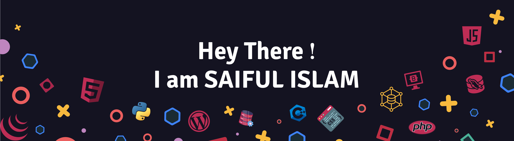

📍Dhaka, Bangladesh | 👨🏻‍💻 Open Source WordPress Theme & Plugin Developer | 🎓 ECE Graduate

## 👨‍🎓 ABOUT ME
 
Greetings! I’m Saiful Islam — an enthusiastic <b>WORDPRESS DEVELOPER</b> with over two years of work experience in creating responsive and user-friendly websites. Bachelor of Science in <b>Electronics and Communication Engineering</b> graduate with superior programming skills in the areas of <b>HTML, CSS, PHP, MySQL, JavaScript, and C++</b>. Designed <b>15+ unique WordPress projects</b> delivered, I thrive on solving problems creatively and building high-quality, impactful web solutions.

## 💡 CREATIONS & CONTRIBUTIONS 
<ins>𝗖𝗨𝗥𝗥𝗘𝗡𝗧 𝗣𝗥𝗢𝗝𝗘𝗖𝗧𝗦:</ins>
-  **[Breaking News](https://github.com/dev2saiful/breaking-news)** - WordPress theme development project for News Channels, Blogs, Newspaper, and Magazine.

<ins>𝗪𝗢𝗥𝗞-𝗶𝗻-𝗣𝗥𝗢𝗚𝗥𝗘𝗦𝗦:</ins>
-  **[Breaking News](https://github.com/dev2saiful/breaking-news)** - WordPress theme development project for News Channels, Blogs, Newspaper, and Magazine.

<ins>𝗟𝗘𝗚𝗔𝗖𝗬 𝗣𝗥𝗢𝗝𝗘𝗖𝗧𝗦</ins>
-  **[Python](https://github.com/dev2saiful/Python-Basic)** - It is complete course of Python Basic.
-  **[Git Demo](https://github.com/dev2saiful/git-demo)** - It is demo repo to learn Git & GitHub !
-  **[Python](https://github.com/dev2saiful/Python-Basic)** - It is complete course of Python Basic.

## 🌟 Featured Projects

  

## ⚙️ SKILLS
-  -

- -

-  -

-  -

## 💼 𝙋𝙍𝙊𝙁𝙀𝙎𝙎𝙄𝙊𝙉𝘼𝙇 𝙀𝙓𝙋𝙀𝙍𝙄𝙀𝙉𝘾𝙀 
- Company Name: [**Fara IT LTD**](https://faraitltd.com/ "Click To Visit")\
Department: **WordPress Design & Development**\
<ins><b>Accomplishments:</b></ins>\
◑ Developed & launched [**15+ WordPress websites**](https://www.fiverr.com/users/dev2saiful/portfolio?roleIds= "Visit some projects") for various industries such as E-commerce, Wholesale, Real Estate, BPO company, E-learning, IT & Software, Digital Agency, Blogs, and 
Personal Portfolio.\
◑ Customized themes & implement proficiency of Elementor, Divi, and WP Bakery.  
◑ Integrated key plugins, including WooCommerce, Yoast SEO, ACF, WP Forms, WPML, Slider Revolution, various payment gateways, etc.\
◑ Improve loading speed through WP-Rocket, image optimization, and caching techniques.\
◑ Managed website security, performed regular updates, and fixed bugs.\
◑ Provide technical support and training to clients on website management & updates.

## ⛓️‍💥 _**CONNECT WITH ME**_
 <!--Links-->

## 🎓 𝘾𝙀𝙍𝙏𝙄𝙁𝙄𝘾𝘼𝙏𝙄𝙊𝙉𝙎 & 𝙏𝙍𝘼𝙄𝙉𝙄𝙉𝙂  
━━━━━━━━━━━━━━━━━━━━━━━━━━━━━━━━━━━

