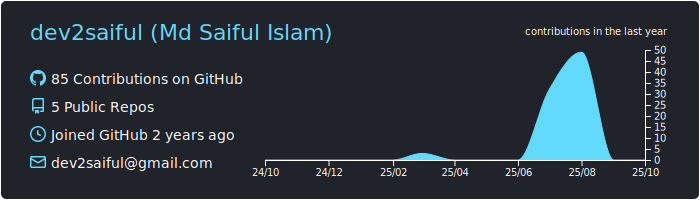

<!--𝑩𝑨𝑵𝑵𝑬𝑹-->

📍Dhaka, Bangladesh | 👨🏻‍💻 Open Source WordPress Theme & Plugin Developer | 🎓 ECE Graduate

<!--𝑨𝑩𝑶𝑼𝑻 𝑴𝑬-->
## 👨‍🎓 ABOUT ME
>
Greetings! I’m Saiful Islam — an enthusiastic <b>WORDPRESS DEVELOPER</b> with over two years of work experience in creating responsive and user-friendly websites. Bachelor of Science in <b>Electronics and Communication Engineering</b> graduate with superior programming skills in the areas of <b>HTML, CSS, PHP, MySQL, JavaScript, and C++</b>. Designed <b>15+ unique WordPress projects</b> delivered, I thrive on solving problems creatively and building high-quality, impactful web solutions.

<!--𝑪𝑹𝑬𝑨𝑻𝑰𝑶𝑵𝑺 & 𝑪𝑶𝑵𝑻𝑹𝑰𝑩𝑼𝑻𝑰𝑶𝑵𝑺 -->
## 💡 CREATIONS & CONTRIBUTIONS 
<ins>𝗖𝗨𝗥𝗥𝗘𝗡𝗧 𝗣𝗥𝗢𝗝𝗘𝗖𝗧𝗦:</ins>
-  **[Breaking News](https://github.com/dev2saiful/breaking-news)** - WordPress theme development project for `News Channels, Blogs, Newspaper, and Magazine.`

<ins>𝗪𝗢𝗥𝗞-𝗶𝗻-𝗣𝗥𝗢𝗚𝗥𝗘𝗦𝗦:</ins>
-  **[Breaking News](https://github.com/dev2saiful/breaking-news)** - WordPress theme development project for `News Channels, Blogs, Newspaper, and Magazine.`

<ins>𝗟𝗘𝗚𝗔𝗖𝗬 𝗣𝗥𝗢𝗝𝗘𝗖𝗧𝗦</ins>
-  **[Python](https://github.com/dev2saiful/Python-Basic)** - It is a complete course of `Python Basic.`
-  **[Git Demo](https://github.com/dev2saiful/git-demo)** - It is demo repo to learn Git & GitHub !
-  **[Python](https://github.com/dev2saiful/Python-Basic)** - It is a complete course of `Python Basic.`

<!--𝑭𝑬𝑨𝑻𝑼𝑹𝑬𝑫 𝑷𝑹𝑶𝑱𝑬𝑪𝑻𝑺-->
## 🌟 FEATURED PROJECTS
<!-- title_color=5ba4e5&text_color=ffffff&bg_color=03031485&icon_color=00E6FE&border_color=5b8fa9 -->

  

<!--𝑮𝑰𝑻𝑯𝑼𝑩 𝑨𝑪𝑻𝑰𝑽𝑰𝑻𝒀 & 𝑺𝑻𝑨𝑻𝑺-->
## 📊 GITHUB ACTIVITY & STATS

  

<a align="center"> 
    
 <!--
  
 -->
 
 <!--
 
 -->
</a>

<!--𝑺𝑲𝑰𝑳𝑳𝑺-->
## ⚙️ SKILLS
-  -

- -

-  -

-  -

<!--𝙋𝙍𝙊𝙁𝙀𝙎𝙎𝙄𝙊𝙉𝘼𝙇 𝙀𝙓𝙋𝙀𝙍𝙄𝙀𝙉𝘾𝙀-->

 
💼 𝙋𝙍𝙊𝙁𝙀𝙎𝙎𝙄𝙊𝙉𝘼𝙇 𝙀𝙓𝙋𝙀𝙍𝙄𝙀𝙉𝘾𝙀

 
>**Company Name**: [**Fara IT LTD**](https://faraitltd.com/ "Click To Visit")\
Department: **WordPress Design & Development**\
<ins><b>Accomplishments:</b></ins>\
◑ Developed & launched [**15+ WordPress websites**](https://www.fiverr.com/users/dev2saiful/portfolio?roleIds= "Visit some projects") for various industries such as `E-commerce, Wholesale, Real Estate, BPO company, E-learning, IT & Software, Digital Agency, Blogs, and Personal Portfolio.`\
◑ Customised themes & implement proficiency of `Elementor, Divi, and WP Bakery.`  
◑ Integrated key plugins, including `WooCommerce, Yoast SEO, ACF, Slider Revolution, & various payment gateways.`\
◑ Improve loading speed through WP-Rocket, image optimization, and caching techniques.\
◑ Managed website security, performed regular updates, and fixed bugs.\
◑ Provide technical support and training to clients on website management & updates.

<!--𝑪𝑶𝑵𝑵𝑬𝑪𝑻 𝑾𝑰𝑻𝑯 𝑴𝑬-->
## ⛓️‍💥 CONNECT WITH ME

 
 
   
 
   
 
 

<!--

`CACHE_SECONDS`
-->
